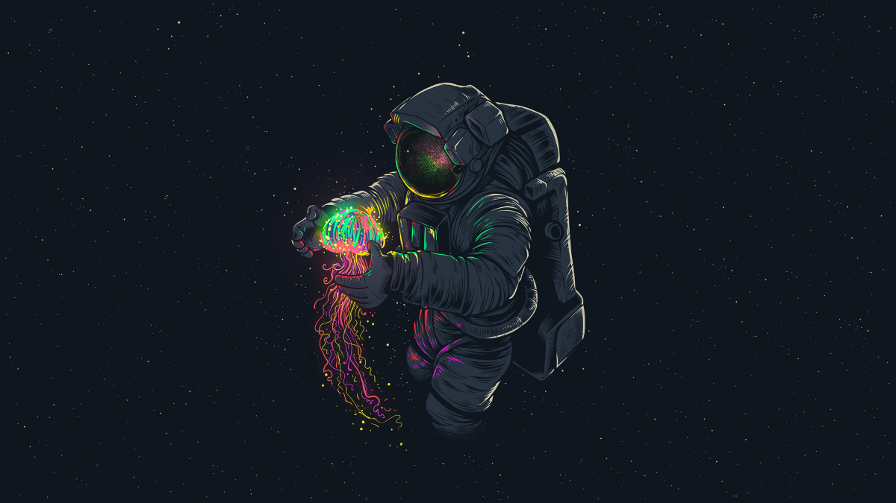
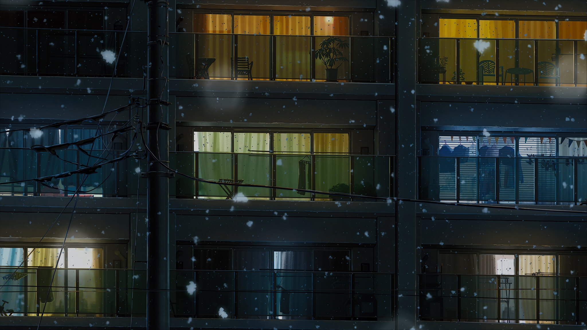
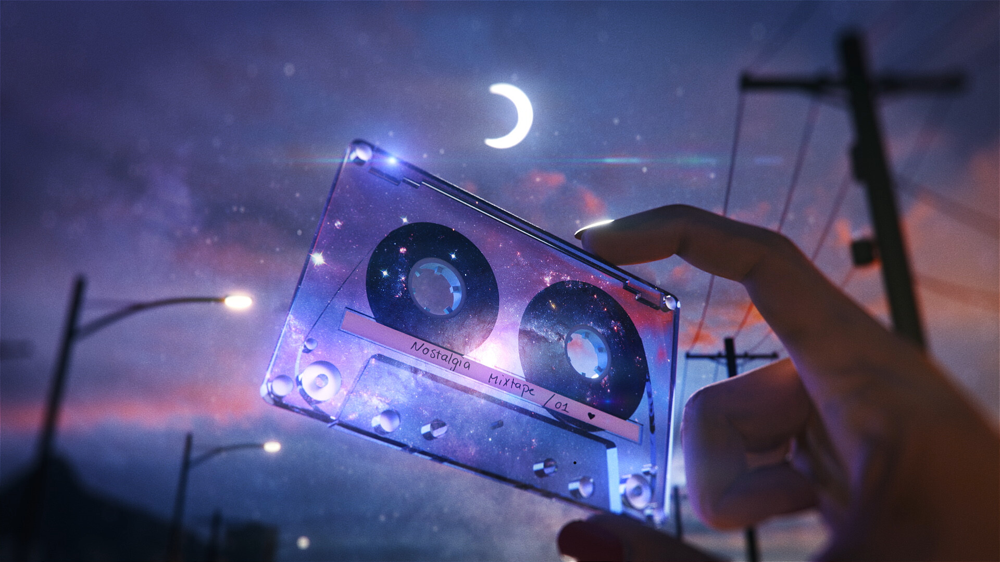
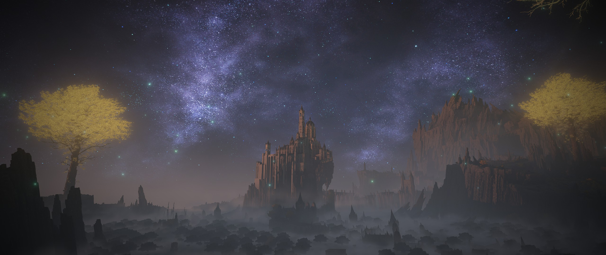
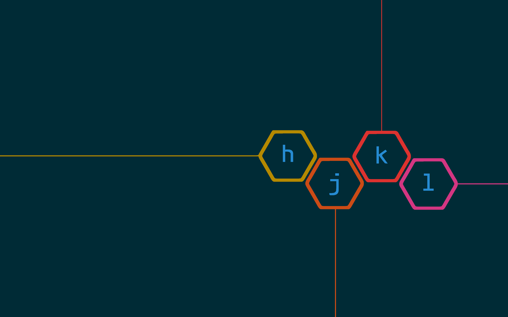

---
hide:
    - navigation
    - toc
---

# Space

-   

    **3d Cubes In Zero Gravity**

-   

    **Alien Landscape With Stars**

-   

    **Astronaut In Space Suit 1**

-   

    **Astronaut In Space Suit**

-   

    **Astronaut Near Black Hole**

-   

    **Astronaut With Plant**

-   

    **Black Hole Void**

-   

    **Blue Alien Landscape**

-   

    **Blue And Black Starry Sky**

-   

    **City In Space With People**

-   

    **City With Alien Architecture**

-   

    **Colorful Black Hole**

-   

    **Colorful Space Creature**

-   

    **Cosmic Black Hole**

-   

    **Crashed Rocket On Mountain**

-   

    **Cyber City In Space**

-   

    **Cyberpunk City With Flying Ships**

-   

    **Cyberpunk Cityscape**

-   

    **Darkness With Lights**

-   

    **Darth Vader In Space**

-   

    **Distant Cityscape At Night**

-   

    **Distant Double Moon**

-   

    **Distant Planet Landscape**

-   

    **Distant Platform In Space**

-   

    **Distant Purple Sky**

-   

    **Distant Red Planet**

-   

    **Earth And Milkyway**

-   

    **Free Fall Cityscape**

-   

    **Galactic White Lettering**

-   

    **Galaxy Archway**

-   

    **Galaxy Cassette**

-   

    **Galaxy In Space**

-   

    **Galaxy Over Water**

-   

    **Galaxy Purple Arch**

-   

    **Galaxy Stars And Planets**

-   

    **Galaxy Stars Planets**

-   

    **Galaxy With Ancient Ruins**

-   

    **Galaxy With Clouds**

-   

    **Galaxy With Planets**

-   

    **Galaxy With Starry Sky**

-   

    **Galaxy With Stars 1**

-   

    **Galaxy With Stars 1**

-   

    **Galaxy With Stars 2**

-   

    **Galaxy With Stars 3**

-   

    **Galaxy With Stars 4**

-   

    **Galaxy With Stars 5**

-   

    **Galaxy With Stars**

-   

    **Galaxy With Stars**

-   

    **Galaxy With Two Riders**

-   

    **Giant Alien Creature**

-   

    **Giant Metal Space Station**

-   

    **Girl In Motorcycle Helmet**

-   

    **Glowing Orange Sphere**

-   

    **Glowing Portal To Another World**

-   

    **Green Lights In Sky**

-   

    **Green Lights In Sky**

-   

    **Japanese Nasa Logo**

-   

    **Lunar Surface At Night**

-   

    **Multiverse With Strange Powers**

-   

    **Nebula Cat**

-   

    **Nebula In Distant Galaxy**

-   

    **Nebula In Space 1**

-   

    **Nebula In Space**

-   

    **Nebula In The Sky**

-   

    **Nebula Star Field**

-   

    **Nebula With Greenish Light**

-   

    **Nebula With Stars 1**

-   

    **Nebula With Stars And Galaxies**

-   

    **Nebula With Stars**

-   

    **Nebula With Stars**

-   

    **Neon Lit Cityscape**

-   

    **Neon Pyramid In Space**

-   

    **Neon Rainbow Arch 1**

-   

    **Neon Rainbow Arch**

-   

    **Neon Red Abstract Patterns**

-   

    **Neon Ring In Space**

-   

    **Neon Samurai In Space**

-   

    **Neon Space Arch 1**

-   

    **Neon Space Arch**

-   

    **Neon Stars In Space**

-   

    **Neon Tigers In Space**

-   

    **Purple Starry Night**

-   

    **Rainbow Colored Stars**

-   

    **Red Planet With Craters**

-   

    **Red Planet With Road**

-   

    **Red Planet With Three Figures**

-   

    **Ship In Starry Sky**

-   

    **Solar System With Clouds**

-   

    **Space Battle With Ship**

-   

    **Space Dock With Blue Sky**

-   

    **Space Station In Orbit**

-   

    **Spacecraft In Space**

-   

    **Spacecraft Launch Into Atmosphere**

-   

    **Spiderman In Space**

-   

    **Star Trek Rainbow Bridge**

-   

    **Starry Night Sky 1**

-   

    **Starry Night Sky**

-   

    **Starship Rainbow Nebula**

-   

    **Sunset On Distant Planet**

-   

    **Sunset Over Distant Stars**

-   

    **Vastness Of Stars**

-   

    **Vibrant Gradient Sky**

-   

    **White A In Black Background**

